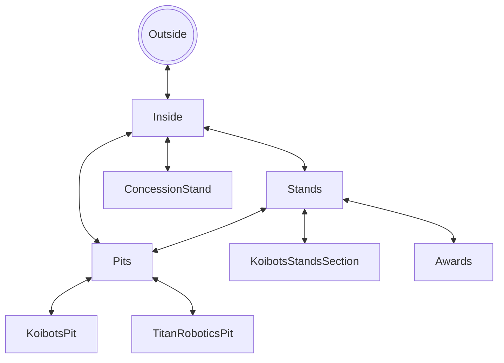

#Title

Wasting away in the pits

#Setting
 
Alexandria regional FRC First Chesapeake District where team 8230 KoiBots from Arlington Virginia

#Map

#Story

You arrive at hayfeild Secondary for the second day of alexandria regional FRC tournament and set out the koitbots area in the stands then you head to the koibots pits to work on issues with one of the swereve modules after working for a while you get sent back to the stands as the robot ques for a match you cheer during the match and lose repeat but fix something else then you win the next 2 matches you get selcected for alliance 4 after being selected you go outside for a team photo and then but 3 slices of pizza eat them each in 2 bites and work on fixing the climber with jake and toby and make it to semi finals where you get eliminated and then win the team spirit award.

#Global Variables

Match counter, Eaten or not, and broken swerve module or not
